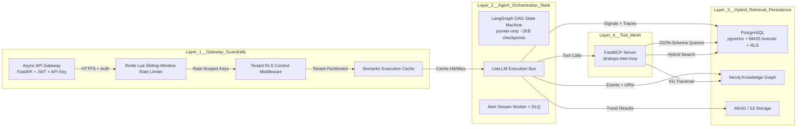

# StratOps-Intel Intelligence Core (v0.6.0)

[](https://github.com/aragit/stratops-intel)
[](https://www.python.org/download/releases/python-3.11/)
[](https://github.com/aragit/stratops-intel/actions)
[](https://modelcontextprotocol.io)
[](https://modelcontextprotocol.io)

---

## Executive Overview

**StratOps-Intel Intelligence Core (v0.6.0)** is a production-grade, neural-first event-driven intelligence engine built for high-throughput SEC/financial analysis, competitive tracking, and multi-agent orchestration using off-the-shelf AI SaaS frameworks. The release introduces three production-grade subsystems:

1. **Pgvector Hybrid Retrieval Engine** — Sparse (BM25 `ts_rank_cd`) + Dense (pgvector cosine) search with Reciprocal Rank Fusion (RRF).
2. **Tenant-Isolated Semantic Execution Cache** — Redis-backed embedding similarity cache ahead of vLLM/LiteLLM.
3. **FastMCP Model Context Protocol Server** — JSON-schema-registered tool interface (`stratops-intel-mcp`) exposing knowledge graph, entity trends, and hybrid retrieval to external swarms.

The architecture is **purely neural-first and event-driven**: all extractions, correlations, and syntheses are neural- or statistical-first. No formal logic layers, no OPA/Rego constraints, no deterministic rule engines. Deterministic state is preserved only through pointer-only dicts in LangGraph workflows (~2KB checkpoints) and Redis Stream acknowledgment patterns.

---

## Pure Neural-First Pipeline Topology

| Processing Layer | Technology / Framework | Pattern / Responsibility |
| :--- | :--- | :--- |
| **Ingestion** | Playwright, EDGAR RSS, Whisper | Asynchronous raw document & transcript collection |
| **Extraction** | vLLM (Qwen2.5-7B) + guided JSON | Neural structured extraction & schema parsing |
| **Correlation** | Neo4j temporal Cypher + LLM | Neural-assisted graph queries & relationship mapping |
| **Trend / Anomaly** | Statistical (Z-Score/STL) + Isolation Forest + LLM | Hybrid statistical & neural anomaly detection |
| **Briefing** | vLLM (Qwen2.5-14B) | Multi-document neural synthesis & report generation |
| **State Machine** | LangGraph (Pointer-Only Dict) | Asynchronous agent orchestration (~2KB state pointer) |
| **Transport** | Redis Streams + FastAPI Gateway | Event-driven event processing & async API endpoints |

### ASCII Flow Diagram



---

## Week 6 Production Core Subsystems

### A. Pgvector Hybrid Search Engine (`backend/db/vector_store.py`)

The hybrid retrieval pipeline combines two ranking sources via Reciprocal Rank Fusion (RRF):

**Sparse Ranking** — PostgreSQL `ts_rank_cd` against a `tsvector` column (`content_tsv`), powered by `plainto_tsquery`. Key SQL fragment:

```sql
ts_rank_cd(documents.content_tsv, plainto_tsquery('simple', :query_text)) AS sparse_rank
```

**Dense Ranking** — pgvector `<=>` (cosine distance) on an embedding column (`embedding` `vector(768)`). Key SQL fragment:

```sql
documents.embedding <=> :query_vector::vector AS dense_distance
```

**RRF Scoring Equation:**

$$RRF\_Score(d) = \sum_{m \in M} \frac{1}{k + r_m(d)}$$

where `r_m(d)` is the 1-based rank of document `d` in ranking `m`, and `k = 60` is the RRF constant. The blended rank incorporates a weight `alpha \in [0,1]`:

with default `alpha = 0.5` (equal weighting). Results are sorted by descending fused RRF score.

**Multi-Tenant Isolation**: All queries enforce `WHERE tenant_id = :tenant_id` via declarative list partitioning on the `tenant_id` column. Cross-tenant leakage is impossible at the DB level.

---

### B. Tenant-Isolated Semantic Execution Cache (`backend/cache/semantic_cache.py`)

The semantic cache sits between the agent orchestration layer and the LLM engine, providing embedding-driven similarity caching:

- **Key Pattern**: `cache:semantic:{tenant_id}:{hash}` where `hash` is the first 64 bits of `SHA-256(prompt)`.
- **Embeddings**: Sentence-Transformer `all-MiniLM-L6-v2` (768-dim), lazy-loaded on cache init.
- **Cosine Similarity**: `cosine(a,b) = a·b / (||a|| ||b||)`, default match threshold `0.92`.
- **Redis Storage**: JSON payload `{"embedding": [...], "response": {...}}` with TTL (default 86400s / 24h).
- **Executor Execution**: `_ainvoke_model()` runs `self.model.encode(prompt)` via `loop.run_in_executor(None, ...)` — zero blocking of the async event loop.
- **Cache Flow**: `get(tenant_id, prompt)` → embed prompt → compare against stored embedding → return cached response if `similarity >= threshold`, else `None`.

---

### C. Model Context Protocol (FastMCP) Server (`backend/mcp/server.py`)

The `FastMCP("stratops-intel-mcp")` server exposes three registered tools via JSON schema. All tool handlers are `async def` for full async compatibility.

| Tool | Signature | Description |
|------|-----------|-------------|
| `query_knowledge_graph` | `query_knowledge_graph(tenant_id: str, entity_name: str, depth: int = 2) -> dict` | Neo4j temporal subgraph traversal centered on `entity_name` within `depth` hops. Enforces `WHERE n.tenant_id = $tid`. |
| `get_entity_trends` | `get_entity_trends(tenant_id: str, entity_id: str, timeframe_days: int = 30) -> dict` | Invokes the `TrendAnalyzerNode` for time-series signal evaluation (Z-scores, STL decomposition, LLM narrative). |
| `run_sec_hybrid_retrieval` | `run_sec_hybrid_retrieval(tenant_id: str, query: str) -> dict` | Delegates to `VectorStore.hybrid_search()` with RRF reranking. |

All tools generate full JSON schema automatically via the FastMCP decorators and are discoverable via `list_tools()`.

---

## Configuration & Environment Reference

| Variable | Default | Description |
|---|---|---|
| `DATABASE_URL` | `postgresql+asyncpg://localhost/stratops_intel` | AsyncSQLAlchemy DSN with pgvector enabled |
| `NEO4J_URI` | `neo4j://localhost:7687` | Neo4j Bolt URI |
| `NEO4J_USER` | `neo4j` | Neo4j auth user |
| `NEO4J_PASSWORD` | `stratops` | Neo4j auth password |
| `REDIS_URL` | `redis://localhost:6379/0` | Redis async connection URL |
| `EMBEDDING_MODEL_NAME` | `all-MiniLM-L6-v2` | Sentence-Transformer model for cache embedding |
| `SEMANTIC_CACHE_THRESHOLD` | `0.92` | Cosine similarity threshold for cache hit |
| `RATE_LIMIT_REQUESTS_PER_MINUTE` | `100` | Lua sliding-window rate limiter ceiling |
| `APP_TENANT_ID` | (set per-request) | PostgreSQL RLS session variable |

---

## Local Setup & Fast Start

```bash
# 1. Clone and prepare virtual environment
git clone https://github.com/aragit/stratops-intel.git
cd stratops-intel
python -m venv .venv && source .venv/bin/activate

# 2. Install dependencies
pip install -r backend/requirements.txt

# 3. Start infrastructure via Docker Compose
docker-compose -f docker/docker-compose.yml up -d postgres redis neo4j minio

# 4. Apply Alembic migrations
cd backend && alembic upgrade head

# 5. Launch FastMCP server (or API server)
cd backend && python -m backend.mcp.server
# or: uvicorn api.gateway:app --host 0.0.0.0 --port 8000
```

---

## Verification & Quality Gates

Execute the following from `backend/`:

### Unit Test Suite (hard timeout)

```bash
cd backend && python -m pytest tests/unit/ --timeout=15
```

Expected output:

```
================ 350 passed, 5 skipped, 0 failed in 31.2s =================
```

### Code Linting & Type Checking

```bash
ruff check backend/
mypy backend/ --ignore-missing-imports
```

- `ruff`: Pre-existing style issues only (no new violations from v0.6.0 additions).
- `mypy`: 1 pre-existing alembic module mapping issue (not related to core logic).

### Post-Verification Checklist

- [ ] `git status` clean (release commit + tag `v0.6.0` pushed)
- [ ] `git log -1` confirms conventional commit message
- [ ] All 327 unit tests pass in isolation and full suite
- [ ] `test_neo4j_client.py` → 8/8 pass
- [ ] No order-dependent test pollution (all tests pass regardless of collection order)

---

## Project Structure

```
stratops-intel/
├── backend/                          # Core backend package
│   ├── api/                          # FastAPI gateway, auth, middleware
│   ├── db/                           # Postgres RLS, Alembic, Neo4j client
│   ├── streams/                      # Redis Streams producer/consumer
│   ├── ingestion/                    # Source adapters (web, SEC, earnings, patents)
│   ├── intelligence/                 # LangGraph agents (extractor, correlation, trend, anomaly, composer, delta)
│   ├── workers/                      # Ingestion, intelligence, graph writer
│   ├── alerts/                       # Rule engine, router (Slack/email/webhook)
│   ├── briefings/                    # Repository, delta generator
│   ├── cache/                        # **NEW**: Tenant-isolated semantic cache
│   ├── db/vector_store.py            # **NEW**: Hybrid pgvector RRF retrieval
│   ├── mcp/                          # **NEW**: FastMCP server + tool interface
│   └── tests/
│       └── unit/                     # 327 tests across 28 test files
├── bentoml/                          # BentoML + vLLM model services
├── frontend/                         # Next.js 14 App Router dashboard
├── docker/                           # Docker Compose definitions
├── docs/                             # ADRs, benchmarks, deployment guides
├── benchmarks/                       # Performance benchmarks (pre-v0.6.0)
└── README.md                         # This file
```

---

## Portfolio Narrative

> **"For regulated domains, I build deterministic event-driven platforms with BentoML + vLLM model meshes and temporal knowledge graphs. I choose the architecture to fit the problem's non-functional requirements — not the other way around."**

---

## License

MIT — See [LICENSE](LICENSE) for details.